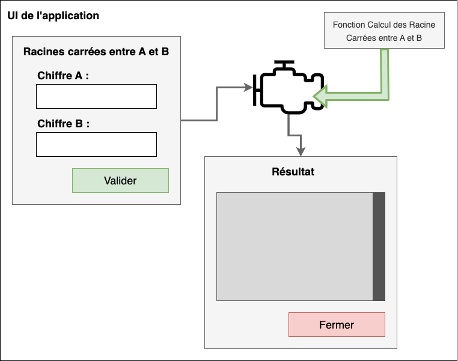
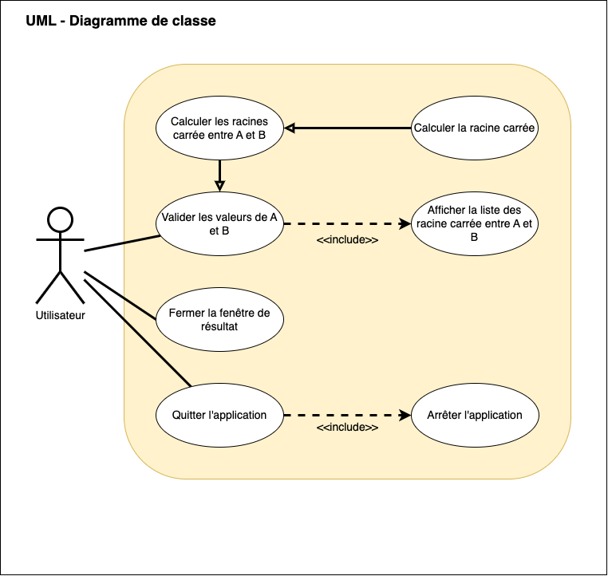

# ESIEE - 2023 - Qualité Logiciels

## 1 - Requis

- JDK : **17**

## 2 - Documentations

- [Documentation JUnit](Doc_JUnit.md)

## 3 - Applications

### 3.1 - Excercices d'entrenement :

**Description** : Petit programme de test

**Dossier** : [qualite_logiciels_app_1/](/qualite_logiciels_app_1/)

### 3.2 - TP 1 : 

**Description** : Petit programme sur **les racines carrée**

**Dossier** : [qualite_logiciels_app_2/](/qualite_logiciels_app_2/)

**Structure :**

- Codes principaux : ✅
- Codes de tests : ✅

**Résultat de la couverture des tests :**


```
---- IntelliJ IDEA coverage runner ---- 
sampling ...
include patterns:
fr\.ldumay\.models\..*
exclude patterns:
exclude annotations patterns:
.*Generated.*
Résultats des tests :
OK : Execution-Test-allRacineCarree()
OK : After-Test
OK : Exception-Test-RacineCarree
OK : Exception-Test-AllRacineCarree
OK : Before-Test
OK : Execution-Test-RacineCarree
OK : Timeout-Test-RacineCarree
OK : Timeout-Test-AllRacineCarree
Class transformation time: 0.023668568s for 757 classes or 3.126627212681638E-5s per class
```

Report disponible ici : `qualite_logiciels_app_2/htmlReport/index.html`

### 3.3 - Excercices d'entrainement : 

**Description** : Petit programme sur **les racines carrée**

**Dossier** : [qualite_logiciels_app_3/](/qualite_logiciels_app_3/)





