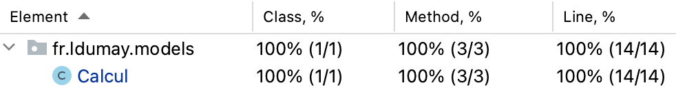

# ESIEE-IT - 2023 - Qualité Logiciels <a name="top"></a>

> 🚨 **Projet déplacer ici ▶▶ : [https://github.com/2023-esiee-projectlab/esiee-it_2023_qualite_logiciels](https://github.com/2023-esiee-projectlab/esiee-it_2023_qualite_logiciels)**

## Sommaire

- [1 - Pré-requis](#1)
- [2 - Documentations](#2)
- [3 - Applications](#3)
	- [3.1 - Excercices d'entrenement](#3_1)
	- [3.2 - TP 1](#3_2)
	- [3.3 - TP 2 Rendu](#3_3)

## 1 - Pré-requis - [Haut de page](#top) <a name="1"></a>

- JDK : **17**

## 2 - Documentations - [Haut de page](#top) <a name="2"></a>

- [Documentation JUnit](Doc_JUnit.md)

## 3 - Applications - [Haut de page](#top) <a name="3"></a>

### 3.1 - Excercices d'entrenement - [Haut de page](#top) <a name="3_1"></a>

**Description** : Petit programme de test

**Dossier** : [qualite_logiciels_app_1/](/qualite_logiciels_app_1/)

### 3.2 - TP 1  - [Haut de page](#top) <a name="3_2"></a>

**Description** : Petit programme sur **les racines carrée**

**Dossier** : [qualite_logiciels_app_2/](/qualite_logiciels_app_2/)

**Structure :**

- Codes principaux : ✅
- Codes de tests : ✅

**Résultat de la couverture des tests :**



```
---- IntelliJ IDEA coverage runner ---- 
sampling ...
include patterns:
fr\.ldumay\.models\..*
exclude patterns:
exclude annotations patterns:
.*Generated.*
Résultats des tests :
OK : Execution-Test-allRacineCarree()
OK : After-Test
OK : Exception-Test-RacineCarree
OK : Exception-Test-AllRacineCarree
OK : Before-Test
OK : Execution-Test-RacineCarree
OK : Timeout-Test-RacineCarree
OK : Timeout-Test-AllRacineCarree
Class transformation time: 0.023668568s for 757 classes or 3.126627212681638E-5s per class
```

Report disponible ici : `qualite_logiciels_app_2/htmlReport/index.html`

### 3.3 - TP 2 Qualité Logiciels Racine Carrées - [Haut de page](#top) <a name="3_3"></a>

**Description** : Petit programme sur **les racines carrée**

=> [Description complète du projet (+Diagrammes et documentations des tests)](README_TP_RENDU.md)

**Dossier** : [qualite_logiciels_app_3/](/qualite_logiciels_app_3/)
