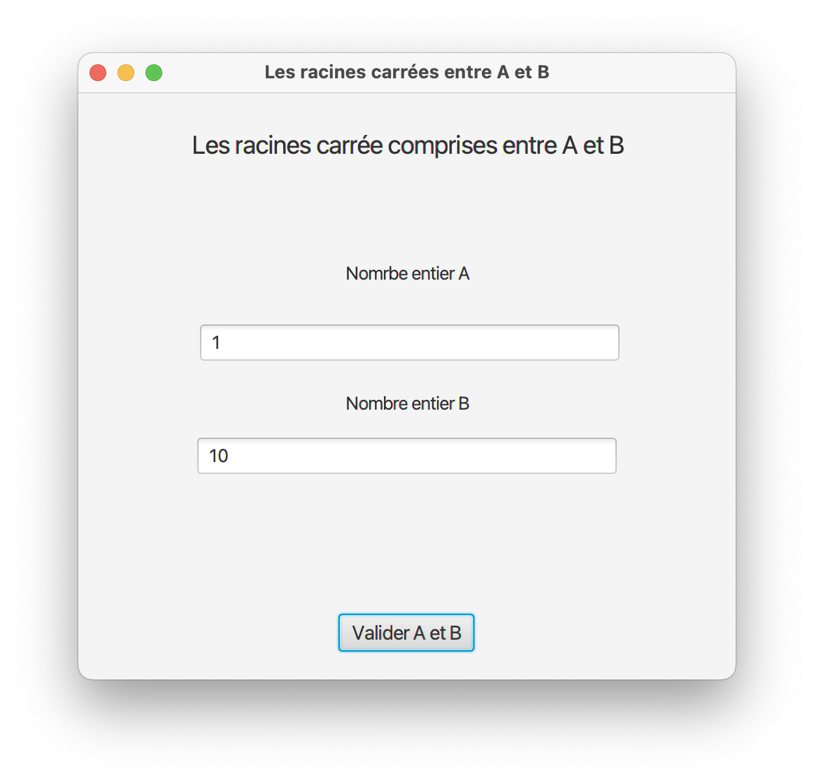
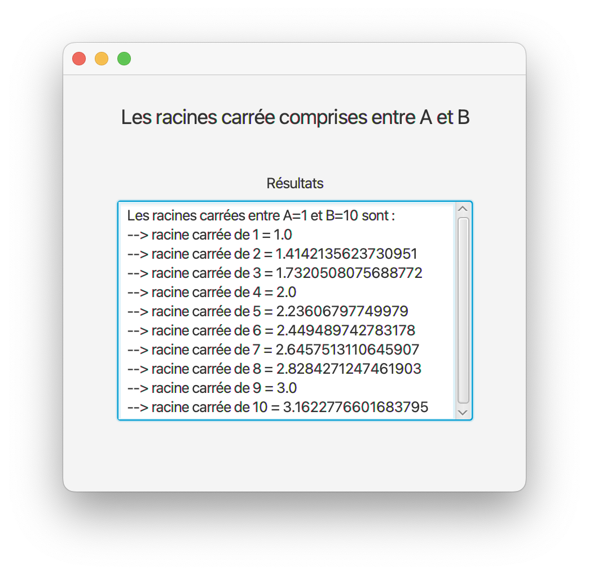

[retour](../../) 

---

# TP Rendu

## Sommaire

- [1 - Pré-requis](#1)
- [2 - Documentations](#2)
- [3 - Applications](#3)
	- [3.1 - Excercices d'entrenement](#3_1)
	- [3.2 - TP 1](#3_2)
	- [3.3 - TP 2 Rendu](#3_3)

## 1 - Description - [Haut de page](#top) 

L'application 3 est un petit programme sur **les racines carrée** permet de calculer et afficher toutes les racines carrées entre deux nombre A et B.

## 2 - Dossier du projet - [Haut de page](#top) 

Le projet se trouve dns le dossier [qualite_logiciels_app_3/](/qualite_logiciels_app_3/).

## 3 - Conception du projet - [Haut de page](#top) 

### 3.1 - Schéma de l'interface - [Haut de page](#top) 

### 3.2 - Diagrammes UML - [Haut de page](#top) 

### 3.3 - Rendu de l'application - [Haut de page](#top) 

